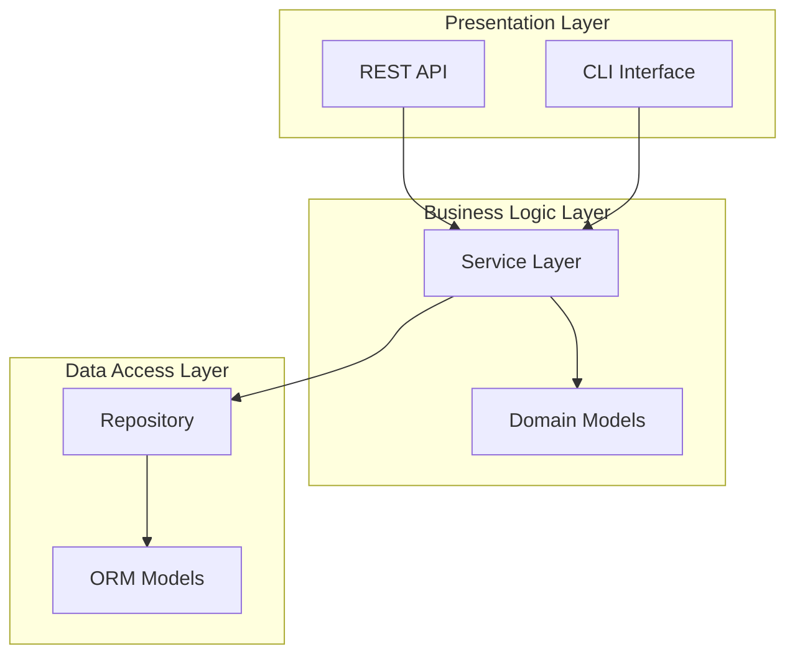
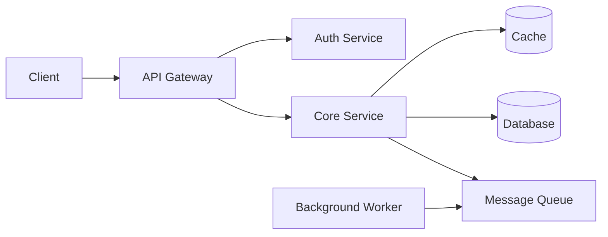
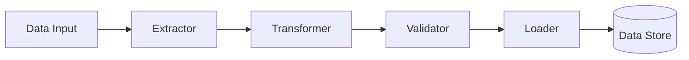

# Codebase Documentation Generator

This skill guides you through creating high-quality technical documentation that describes a Python codebase's architecture and design to an experienced engineer.

## When to Use

- Use this skill when analyzing a Python repository to create architectural documentation
- When an engineer needs to understand a codebase's high-level structure and design
- When onboarding senior engineers to a new project
- When documenting system architecture for technical design reviews
- When creating reference documentation that explains "how the system works" rather than "how to use it"

## Instructions

### 1. Initial Repository Analysis

First, explore the repository structure to understand its organization:
```bash
# Get directory structure
find /path/to/repo -type f -name "*.py" | head -50
tree -L 3 /path/to/repo  # if available

# Identify key files
ls -la /path/to/repo
cat /path/to/repo/README.md
cat /path/to/repo/setup.py  # or pyproject.toml
```

Look for:
- Entry points (main.py, __main__.py, CLI scripts)
- Configuration files (config.py, settings.py, .env files)
- Core modules (usually in src/, lib/, or project name directory)
- Tests directory structure
- Dependencies (requirements.txt, pyproject.toml, Pipfile)

### 2. Identify System Architecture Patterns

Determine the architectural style:
- **Layered architecture**: Presentation, business logic, data access layers
- **Microservices**: Multiple independent services
- **Event-driven**: Message queues, pub/sub patterns
- **Plugin-based**: Extensible core with plugins
- **MVC/MVT**: Model-View-Controller patterns
- **Pipeline/ETL**: Data processing workflows
- **Client-Server**: API servers, background workers

### 3. Map Core Components

Identify and categorize major components:

**Core Abstractions**:
- Base classes and interfaces
- Abstract base classes (ABCs)
- Protocol classes (typing.Protocol)
- Key design patterns (Factory, Strategy, Observer, etc.)

**Data Models**:
- Domain entities (dataclasses, Pydantic models, ORM models)
- DTOs (Data Transfer Objects)
- Configuration structures
- State representations

**Business Logic**:
- Services and managers
- Processors and handlers
- Validators and transformers
- Domain-specific algorithms

**Infrastructure**:
- Database access layers
- API clients and integrations
- Caching mechanisms
- Message queue interfaces

### 4. Create System Architecture Diagram

Use Mermaid to visualize the system. Choose the appropriate diagram type:

**For layered architectures**:


**For component-based systems**:


**For data flow pipelines**:


### 5. Document Structure

Create a markdown document with the following sections:

#### Required Sections:

**1. Overview** (2-3 paragraphs)
- What the system does (purpose and domain)
- Who it's for (target users/use cases)
- Key capabilities and constraints

**2. System Architecture** (with Mermaid diagram)
- High-level component diagram
- Architecture pattern explanation
- Major subsystems and their responsibilities
- Communication patterns between components

**3. Core Concepts & Abstractions**
- Fundamental abstractions that define the system
- Key interfaces and base classes
- Design patterns employed
- Domain-specific terminology

**4. Data Models**
- Primary entities and their relationships
- Data flow through the system
- State management approach
- Persistence strategy

**5. Component Deep-Dive**
For each major component:
- Purpose and responsibility
- Key classes/modules
- Dependencies and relationships
- Entry points and public interfaces

**6. Technical Details**
- Technology stack (frameworks, libraries)
- External dependencies
- Configuration and environment
- Build and deployment considerations

#### Optional Sections (include if relevant):

**7. Key Workflows**
- Critical user journeys or data flows
- Step-by-step sequence for important operations

**8. Extension Points**
- How to extend or customize the system
- Plugin mechanisms or hooks
- Configuration options

**9. Design Decisions**
- Important architectural choices
- Tradeoffs made
- Rationale for key patterns

### 6. Writing Guidelines

**Tone & Audience**:
- Write for staff/principal engineers who understand software architecture
- Assume knowledge of design patterns, architectural styles, and best practices
- Be concise but comprehensive—avoid over-explaining basics
- Use precise technical terminology

**Content Principles**:
- Focus on "why" and "how it works", not "how to use it"
- Explain the mental model an engineer needs to reason about the system
- Highlight non-obvious design decisions and patterns
- Call out important constraints or invariants
- Avoid tutorial-style step-by-step instructions

**Code References**:
- Reference specific files/classes when illustrating concepts
- Use short, relevant code snippets (5-10 lines max)
- Format code blocks with Python syntax highlighting
- Include file paths: `src/services/auth.py`

**Clarity**:
- Use headers and subheaders for scanability
- Keep paragraphs focused (3-5 sentences)
- Use bullet points for lists of items
- Bold key terms on first usage
- Include Mermaid diagrams for visual clarity

### 7. Analysis Process

Follow this systematic approach:

1. **Start at the entry points**: Trace from main.py, CLI commands, or API routes
2. **Follow the imports**: Build a dependency graph of modules
3. **Identify layers**: Group files by their architectural role
4. **Find the core**: Locate domain models and business logic
5. **Map data flow**: Track how data moves through the system
6. **Document patterns**: Note recurring design patterns
7. **Capture dependencies**: List frameworks, libraries, external services

### 8. Quality Checklist

Before finalizing, ensure the documentation:

- [ ] Has a clear, accurate Mermaid architecture diagram
- [ ] Explains the system's purpose and domain
- [ ] Identifies all major components and their responsibilities
- [ ] Describes core abstractions and their relationships
- [ ] Documents data models and their lifecycle
- [ ] References specific files/classes for key components
- [ ] Explains how components communicate
- [ ] Notes important design decisions or patterns
- [ ] Is scannable with clear headers and structure
- [ ] Uses appropriate technical depth for the audience
- [ ] Has accurate file paths and code references

### 9. Common Pitfalls to Avoid

- **Don't write user documentation**: Focus on architecture, not usage
- **Don't exhaustively list every file**: Highlight key components only
- **Don't explain basic concepts**: Assume engineering expertise
- **Don't use vague descriptions**: Be specific about responsibilities
- **Don't ignore the big picture**: Start with architecture before details
- **Don't create overly complex diagrams**: Keep diagrams focused and readable
- **Don't forget the "why"**: Explain rationale for design choices

### 10. Example Output Structure
```markdown
# [Project Name] Technical Architecture

## Overview
[2-3 paragraph description of system purpose, capabilities, and context]

## System Architecture

[Mermaid diagram showing high-level architecture]

[1-2 paragraphs explaining the architecture pattern and design philosophy]

## Core Concepts

### [Concept 1]
[Description with code references]

### [Concept 2]
[Description with code references]

## Data Models

### [Entity 1]
[Description, relationships, lifecycle]

### [Entity 2]
[Description, relationships, lifecycle]

## Component Breakdown

### [Component 1]: [Name]
**Purpose**: [What it does]
**Location**: `path/to/component`
**Key Classes**: 
- `ClassName1`: [Brief description]
- `ClassName2`: [Brief description]

**Dependencies**: [What it depends on]
**Used By**: [What depends on it]

[Additional details as needed]

## Technical Stack
- **Framework**: [e.g., FastAPI, Django, Flask]
- **Database**: [e.g., PostgreSQL, MongoDB]
- **Key Libraries**: [Important dependencies]

## Key Design Decisions
- [Decision 1 and rationale]
- [Decision 2 and rationale]
```

### 11. Interaction with User

If you need clarification:

- **Ask about scope**: "Should I focus on the core engine or include deployment infrastructure?"
- **Clarify audience**: "Are we documenting for engineers joining the team or for external review?"
- **Verify depth**: "Should I include detailed sequence diagrams for key workflows?"
- **Check focus areas**: "Are there specific components you want emphasized?"

Use the conversation naturally—don't ask all questions upfront, but clarify as needed while analyzing.

## Output Location

Save the final documentation  `system-architecture.md` in the root directory of the project. 