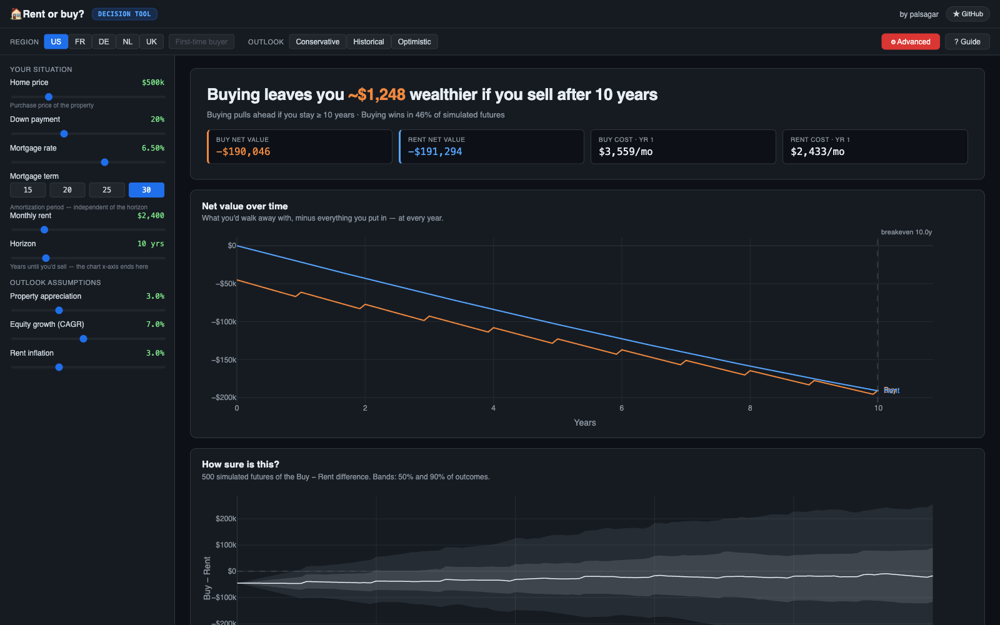
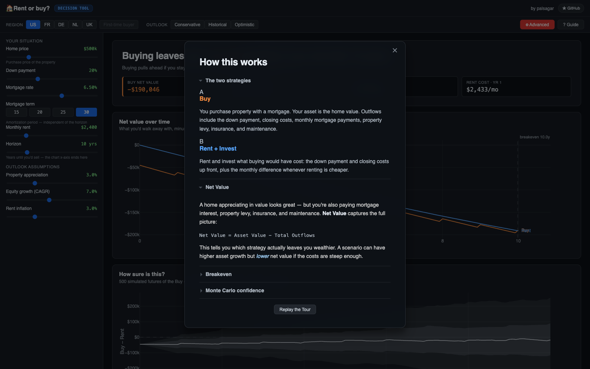

<div align="center">

# 🏠 Rent or Buy?

**The buy-vs-rent decision simulator — which strategy leaves you wealthier, and how sure can you be.**

</div>



## Run it

```bash
uv run uvicorn simulator.server:app --port 8000
```

Open http://localhost:8000.

## Using Rent or Buy?

- A **12-step tour** walks you through every feature on first visit; replay it anytime via **Replay the Tour** in the guide.
- The **`?` button** opens the in-app guide — the concepts behind the verdict, one click away.
- **Region presets** — United States, France (Lyon), Germany (Köln), Netherlands, United Kingdom (England & NI) — fill in tax rules, buyer costs and typical prices, rendered in each market's currency.
- **First-time-buyer relief** where a region enacts it — on by default, withdrawing itself above the statutory price cap.
- **Market outlook** — conservative, historical, or optimistic growth and inflation assumptions.
- **Advanced drawer** — tax deductibility, capital gains, levies, maintenance; every default follows the selected region.

Every slider input updates the charts live, and the address bar is always a shareable link to your exact scenario.



## Understanding & hacking Rent or Buy?

- [docs/README.md](docs/README.md) — full annotated index
- [docs/architecture.md](docs/architecture.md) — system + module map
- [docs/formulas.md](docs/formulas.md) — the math behind the engine (Net Value, Monte Carlo, tax primitives)
- [docs/adr/README.md](docs/adr/README.md) — 9 design decisions
- [CONTEXT.md](CONTEXT.md) — project vocabulary
- [DEPLOYMENT.md](DEPLOYMENT.md) — Docker + analytics wiring

## Numbers

Verified from source, not asserted:

- **12 tour steps** (`src/simulator/static/js/tour.js`) — welcome → region presets → first-time-buyer relief → outlook → situation → verdict → decision chart → fan/tornado → advanced → numbers → guide → all set.
- **5 region bundles** (`src/simulator/regions.py`) — United States, France (Lyon), Germany (Köln), Netherlands, United Kingdom (England & NI); **United States** is the shipped default on a fresh load.
- **Monte Carlo defaults** (`src/simulator/models.py`, `MonteCarloConfig`) — **500** simulations, seed **42**, property-appreciation σ **8.0 pp**, equity-growth σ **15.0 pp**, rent-inflation σ **1.5 pp**, correlation ρ **0.3**.
- **12 pytest files** (`tests/test_*.py`), **5 Playwright spec files** (`tests/*.spec.js`): `tour`, `welcome`, `analytics`, `a11y`, `restore`.
- Package **rent-vs-buy-simulator v1.0.0** (`pyproject.toml`).

## Develop

- No build step — a vanilla ES-module frontend served straight from `static/`.
- `uv run pytest tests/ -q` — engine, API, region, Monte Carlo, and Umami tests.
- `npx playwright test` — headless E2E (the config leaves Playwright's default headless mode) over the welcome modal, 12-step tour, analytics contract, a11y, and share/restore specs.
- `Dockerfile` for deploy (FastAPI + static files, `PORT` selects the listen port).

See [docs/formulas.md](docs/formulas.md) for the mathematical reference and [CONTEXT.md](CONTEXT.md) for the vocabulary.
