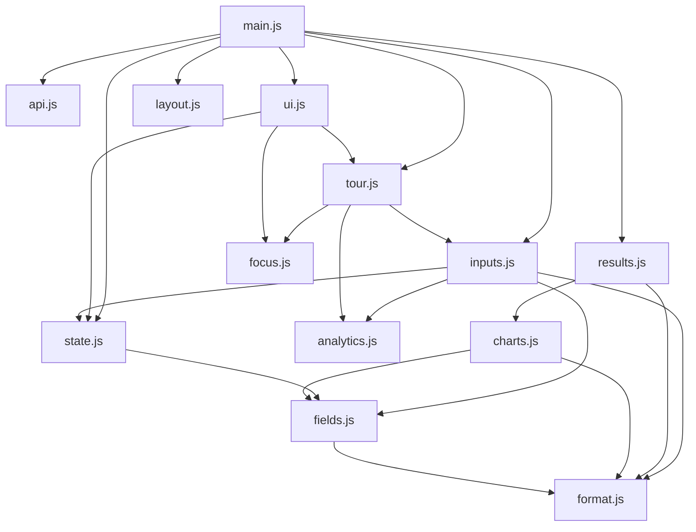

# System Architecture

How Rent or Buy? fits together: the FastAPI backend, the no-build static frontend, the four JSON APIs, and the tour/analytics flow.

Hub: [../README.md](../README.md) · Index: [README.md](README.md) · Related: [Mathematical Reference](formulas.md) · [ADR index](adr/README.md)

## 1. Tech Stack

| Layer | Technology | Notes |
|-------|-----------|-------|
| **Backend** | FastAPI + Uvicorn | `src/simulator/server.py` — static files, four JSON endpoints, two middleware layers. No database, no ORM; every document is a dict over the wire. |
| **Engine** | NumPy (`simulator/engine.py`, `monte_carlo.py`) | Per-path engine is vectorized (no Python loops) — `_net_value_series()` is the single source of truth, called by both the deterministic engine and Monte Carlo. Monte Carlo itself wraps that per-path engine in a Python loop (`for i in range(n_sims)` in `run_monte_carlo`) over the 500 simulated paths. See [formulas.md](formulas.md). |
| **Frontend** | Vanilla ES modules | No build step, no framework. Plotly.js (Chart Studio Basic 2.35.2) from the CDN for charts. |
| **Config** | `SimulationConfig` / `MonteCarloConfig` dataclasses | `models.py`, validated on the way in (`api.py`) and on the way out. |
| **Regions** | Data bundles in `simulator/regions.py` | Five market presets as data; the engine has no per-country logic (ADR-0007). |

## 2. Module Dependency Graph

Thirteen JS modules under `src/simulator/static/js/`:

**`main.js`** — entry point (a module, no exports). Boots the app in order: `readUrl()` → `initPhoneLayout()` → `getRegions()` → `initInputs(regions)` → `initUi(tour)` → `syncInputs()` → `onConfigChange(...)`. `initPhoneLayout` runs before the regions request because it needs only static markup, so phones never show the moved controls in the preset bar first. Falls back to an inline US region if the API is unreachable, and exposes `window.__rvb = { tour }` for browser-driven tests.

**`ui.js`** — `initUi`: welcome modal, guide overlay (accordion sections), the **Replay the Tour** entry point, the inputs and Advanced bottom sheets on small screens (Done button, scrim; one `closeSheets()` path closes both and returns focus to **Edit your numbers** after Done or Esc), the **Share this scenario** button (the native share sheet where the browser has one, else copies the link), error banner and loading state. Depends on `tour.js` (layers the spotlight over the guide), `focus.js` (traps focus in the modal) and `state.js` (`shareUrl`).

**`layout.js`** — `initPhoneLayout`: below the 900 px breakpoint, moves the region, outlook and Advanced controls into the inputs sheet and the Guide button into the title bar, and moves them back above it. It moves nodes rather than cloning them, so ids, listeners and the tour's targets survive.

**`focus.js`** — `moveFocusIn`/`restoreFocus`/`trapFocus`: a focus trap for the welcome modal and tour spotlight, keeping Tab/Shift+Tab within the active overlay and restoring focus on close. Consumed by both `ui.js` and `tour.js`; imports nothing itself.

**`tour.js`** — `Tour` class + the exported `STEPS` array (12 steps). A four-rect spotlight hole frames the target; the rest of the screen is dimmed. On phones it judges a control inside the inputs sheet as visible only against the part of the sheet below its sticky header. Gated by the `rvb.tour.v1` localStorage flag. Step-agnostic engine; `main.js` injects the real steps.

**`state.js`** — the config store: `DEFAULT_CONFIG`, `getConfig`/`setParam`/`applyPreset`, the share-URL codec (`readUrl`/`writeUrl`, and `shareUrl` for the Share button) so the address bar is always a link to the exact scenario. `currentQuery()` is the single serializer behind both `writeUrl` and `shareUrl`. Holds `regionId`. Pulls `INPUT_DEFS` from `fields.js`; nothing imports it back.

**`inputs.js`** — `initInputs`: renders sliders from `INPUT_DEFS` (each slider's value is a button that opens a text field for an exact number, clamped to the range but not snapped to the step; a typed value fires `change` from the slider, so the tour treats it like a drag), wires the region pills, outlook presets, and first-time-buyer pill, and derives the active region from the URL or config. `snapshotSettings`/`restoreSettings` back the tour's "restore what you changed" step.

**`fields.js`** — `INPUT_DEFS`, the input schema (key, label, bounds, step, formatter). A value here is a contract, cross-checked against tests.

**`results.js`** — renders a simulate or Monte Carlo payload into the results DOM, including the toss-up wording when the winner takes 40–60% of simulated futures (ADR-0010), the net-value note, and the live one-line verdict in the phone sheet header; `downloadCsv` exports the year-by-year table.

**`charts.js`** — the five Plotly charts: decision (Net Value over time, with breakeven marker), fan (simulated futures), tornado (sensitivity), outflows, and the ownership-cost breakdown.

**`analytics.js`** — `trackEvent` wrapper around `window.umami`, no-ops when analytics is unconfigured.

**`api.js`** — `serializeForWire` + `postSimulate`/`postMonteCarlo` fetch wrappers; turns a non-2xx FastAPI `detail` into a readable error.

**`format.js`** — currency, money, compact, and percent formatters; `setCurrency` swaps the symbol and Plotly locale per region; `parseTypedNumber(text, integerField)` reads a typed slider value (currency symbols, spaces, `%`, U+2212, `k`/`M` suffixes, `,` vs `.` rules, whole-number rounding).

## 3. Server Middleware

Two `BaseHTTPMiddleware` layers in `server.py`, added to every request:

1. **`NoCacheMiddleware`** — writes security headers (`X-Content-Type-Options`, `Referrer-Policy`, `X-Frame-Options`, a Content-Security-Policy that allows `'self'` plus the Plotly CDN) on every response, and `no-cache` headers on `*.js`/`*.css`/`*.html` and `/` so frontend edits show up live. Also rejects bodies over 64 KiB.

2. **`UmamiInjectionMiddleware`** — splices a `<script defer src="${UMAMI_DOMAIN}/script.js" data-website-id="${UMAMI_ID}">` tag before `</body>` on HTML responses, but only when both env vars are configured and valid. With either var unset, it is a pass-through — local dev and CI are never tracked (see [DEPLOYMENT.md](../DEPLOYMENT.md)). When Umami is enabled, its origin is also added to the CSP `script-src` and `connect-src`.

Static files are served by `StaticFiles` from `src/simulator/static/` (no-cache, live reload).

## 4. APIs

Four JSON endpoints in `server.py`; all config payloads are camelCase-encoded and validated against `SimulationConfig` by `api.py` (unknown fields → 422).

| Endpoint | Method | Body / Params | Returns |
|---|---|---|---|
| `/api/simulate` | POST | `{ camelCase SimulationConfig }` | Deterministic run: the two Net Value series, verdict, breakeven year, year-1 cost breakdown |
| `/api/monte-carlo` | POST | `{ camelCase SimulationConfig }` | `500` simulated futures: buy-wins share, median difference, fan percentiles, tornado sensitivity |
| `/api/regions` | GET | — | The five region bundles (`regions.py`) |
| `/api/health` | GET | — | `{"status": "ok"}` — backs the Docker HEALTHCHECK |

Monte Carlo is CPU-bound (~500 engine runs), so `/api/monte-carlo` is guarded by a bounded semaphore (`os.cpu_count()`-based) so health checks and static serving keep responding under load.

## 5. Tour + Analytics Flow

**Tour.** On first visit, `main.js` starts the `Tour` unless `rvb.tour.v1` is set. The welcome modal offers **Take the Tour** / **Skip to Simulator** / **Read the Guide**. Each spotlight step highlights a live control; click/change steps are detected purely from DOM events, and the tour snapshots settings at start and restores them at the end. `Esc` or the close button exits early. **Replay the Tour** in the guide footer restarts it any time.

**Analytics.** `window.umami` drives pageviews automatically (injected server-side). Custom events fire from `tour.js` (`tour-started`, `tour-completed`, `tour-skipped`), `inputs.js` (`region-changed`, `ftb-toggled`), and the outlook preset handler (`outlook-changed`) — all routed through `analytics.js.trackEvent`, which no-ops when Umami is not configured.

## 6. Test Layout

- `tests/test_*.py` (**12 files**) — pytest over the engine primitives, core, taxes and models; the API serialization (`test_api.py`); region bundles and US regression (`test_regions.py`, `test_us_regression.py`); Monte Carlo calibration and tornado bounds (`test_monte_carlo.py`, `test_tornado_bounds.py`); Umami env validation (`test_umami.py`).
- `tests/*.spec.js` (**5 files**) — Playwright, headless on port 8323 (the config leaves Playwright's default headless mode): `tour.spec.js` walks the 12-step tour, `welcome.spec.js` the welcome modal, `analytics.spec.js` the event contract, `a11y.spec.js` the accessibility checks, `restore.spec.js` the share/restore flow.

Run with `uv run pytest tests/ -q` and `npx playwright test`.
